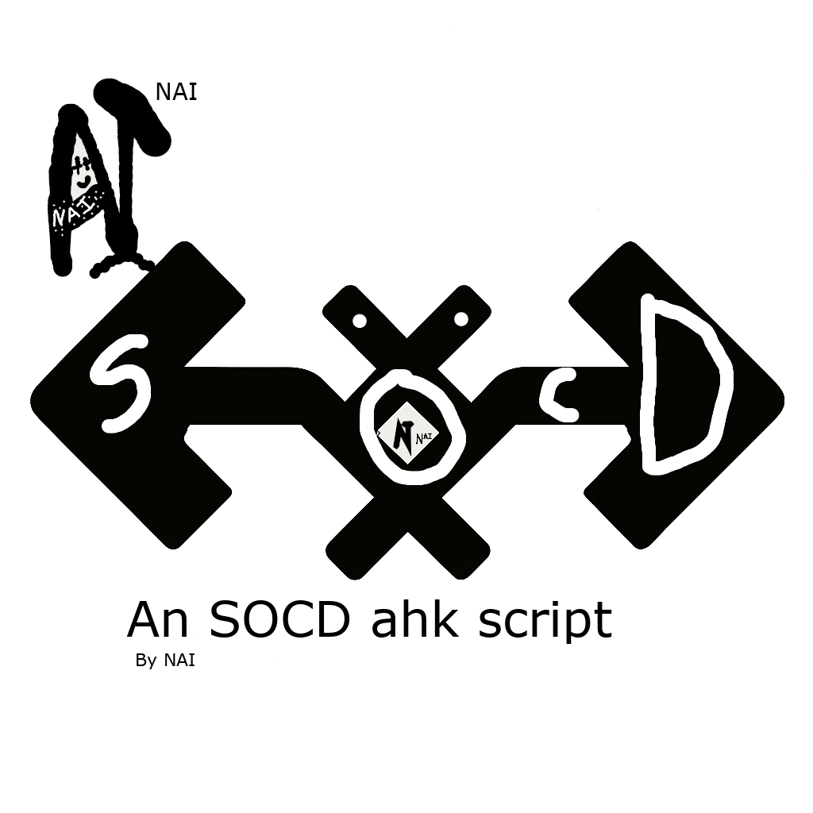

# SOCD-ahk
An SOCD script recreated using AHK built to simulate hardware SOCD via AutoHotkey v2

NAI is a personal concept/identity created by Ncoder and is not a registered trademark or company.
# SOCD-AHK Script

An AutoHotkey v2 script that implements SOCD (Simultaneous Opposite Cardinal Direction) cleaning for keyboard input.  
Designed to provide consistent and predictable movement behavior in games and applications that rely on directional input.

---

## Features

- SOCD input resolution
- AutoHotkey v2 compatible
- Lightweight and fast
- Fully configurable
- Designed for keyboard-based movement systems
- Non-commercial open-source usage

---

## Requirements

- Windows 10/11  
- AutoHotkey v2.x  

Download AutoHotkey v2 from:  
https://www.autohotkey.com/

---

## Installation

1. Clone or download this repository.
2. Install AutoHotkey v2.
3. Run the script:`SOCD.ahk` make sure its in an environment where a `config\` folder can be created optionally `SCOD.ini` inside too
5. Comply with the on-screen instructions to set the script ready (first time only)
6. Press the SOCD key to toggle and the menu key to open the settings menu

---

## Usage

This script resolves opposite directional inputs such as:

| Input | Output |
|------|--------|
| A + D | Neutral / priority-based resolution |
| W + S | Neutral / priority-based resolution |

(Exact behavior depends on your configured mode.)

Use this for:
- Fighting games
- Grid-based movement games
- Competitive keyboard input testing
- Custom control systems

## ⚠️ Important Notice

Do **NOT** use this script in competitive online games such as:
- Valorant  
- CS:GO / CS2  

These games may consider SOCD behavior as unauthorized input modification.

---

## Configuration

All user-adjustable settings are stored in:
  `config\SOCD.ini`

You can modify:
- Resolution mode
- Priority rules
- Hotkeys
- Debug overlays
- Input lanes (split/unified)

Restarting is not nessecary unless changing the ahk script itself

---

## License

This project is licensed under the **SOCD-AHK License**.  
See the `LICENSE` file for full terms.

Summary:
- Free to use, modify, and share
- Attribution required
- Commercial use is forbidden

---

## Disclaimer

This software is provided *as is*, without warranty of any kind.  
Use at your own risk.

---

## Author

Created by **Ncoder**  
2026
